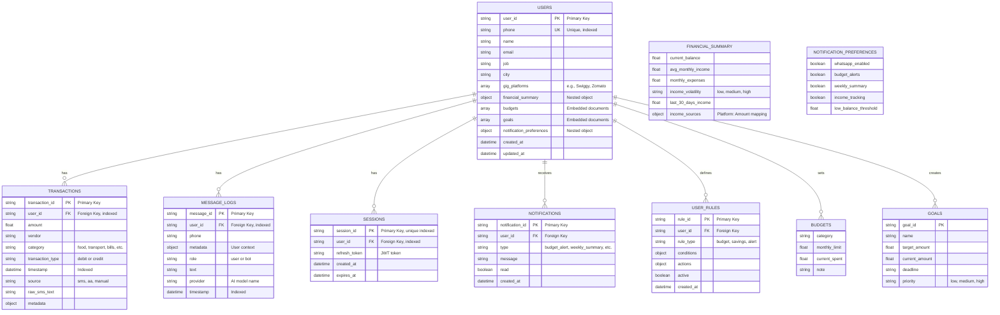
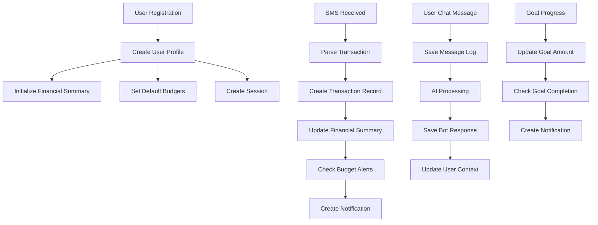

# KIVI Backend Database ER Diagram

## Entity Relationship Diagram



## Collection Descriptions

### Users Collection
**Purpose**: Store user profiles with financial data for gig workers

**Key Features**:
- Unique phone number for authentication
- Multiple gig platform tracking
- Embedded financial summary with income volatility
- Budget and goal management
- Notification preferences

**Indexes**:
- `phone` (unique)

---

### Transactions Collection
**Purpose**: Track all financial transactions (income and expenses)

**Key Features**:
- Support for multiple sources (SMS, Account Aggregator, Manual)
- Category-based classification
- Raw SMS text preservation for audit
- Flexible metadata for additional context

**Indexes**:
- `user_id`
- `timestamp`
- Compound: `user_id + timestamp` (for efficient queries)

---

### Message Logs Collection
**Purpose**: Store conversation history for AI chat interactions

**Key Features**:
- Both user and bot messages
- User context metadata for personalization
- AI provider tracking
- Chronological conversation flow

**Indexes**:
- `user_id`
- `timestamp`
- Compound: `user_id + timestamp`

---

### Sessions Collection
**Purpose**: Manage JWT refresh tokens for authentication

**Key Features**:
- Secure token storage
- Expiration tracking
- User session management

**Indexes**:
- `user_id`
- `session_id` (unique)

---

### Notifications Collection
**Purpose**: Store user notifications and alerts

**Key Features**:
- Multiple notification types
- Read/unread status
- Timestamp tracking

---

### User Rules Collection
**Purpose**: Store custom user-defined rules for automation

**Key Features**:
- Flexible rule conditions
- Configurable actions
- Active/inactive status

---

## Relationships

### One-to-Many Relationships

1. **USERS → TRANSACTIONS**
   - One user has many transactions
   - Foreign Key: `user_id`

2. **USERS → MESSAGE_LOGS**
   - One user has many messages
   - Foreign Key: `user_id`

3. **USERS → SESSIONS**
   - One user has many sessions
   - Foreign Key: `user_id`

4. **USERS → NOTIFICATIONS**
   - One user receives many notifications
   - Foreign Key: `user_id`

5. **USERS → USER_RULES**
   - One user defines many rules
   - Foreign Key: `user_id`

### Embedded Relationships

1. **USERS → BUDGETS**
   - Embedded array within user document
   - No separate collection

2. **USERS → GOALS**
   - Embedded array within user document
   - No separate collection

3. **USERS → FINANCIAL_SUMMARY**
   - Embedded object within user document
   - No separate collection

4. **USERS → NOTIFICATION_PREFERENCES**
   - Embedded object within user document
   - No separate collection

---

## Data Flow



---

## Query Patterns

### Common Queries

1. **Get User by Phone**
   ```javascript
   db.users.findOne({ phone: "+919876543210" })
   ```

2. **Get User Transactions (Last 30 Days)**
   ```javascript
   db.transactions.find({
     user_id: "usr_9876543210",
     timestamp: { $gte: "2025-10-25T00:00:00Z" }
   }).sort({ timestamp: -1 })
   ```

3. **Get Conversation History**
   ```javascript
   db.message_logs.find({
     user_id: "usr_9876543210"
   }).sort({ timestamp: 1 }).limit(50)
   ```

4. **Get Active Sessions**
   ```javascript
   db.sessions.find({
     user_id: "usr_9876543210",
     expires_at: { $gt: new Date().toISOString() }
   })
   ```

5. **Get Transactions by Category**
   ```javascript
   db.transactions.find({
     user_id: "usr_9876543210",
     category: "food",
     timestamp: {
       $gte: "2025-01-01T00:00:00Z",
       $lte: "2025-01-31T23:59:59Z"
     }
   })
   ```

---

## Design Decisions

### Why Embedded Documents?

**Budgets and Goals** are embedded within the User document because:
- They are always accessed with the user profile
- Limited number per user (typically < 10)
- Atomic updates with user data
- Better performance (single query)

### Why Separate Collections?

**Transactions and Message Logs** are separate collections because:
- High volume (potentially thousands per user)
- Independent query patterns
- Need for efficient time-based queries
- Separate indexing requirements

### Indexing Strategy

1. **Single Field Indexes**:
   - `users.phone` - Fast user lookup
   - `sessions.session_id` - Fast session validation

2. **Compound Indexes**:
   - `transactions.user_id + timestamp` - Efficient time-range queries
   - `message_logs.user_id + timestamp` - Conversation history retrieval

---

## Scalability Considerations

1. **Sharding Strategy**: Shard by `user_id` for horizontal scaling
2. **Time-Series Data**: Consider MongoDB Time Series collections for transactions
3. **Archival**: Move old transactions (> 1 year) to archive collection
4. **Caching**: Cache user profiles and recent transactions in Redis
5. **Read Replicas**: Use read replicas for analytics queries

